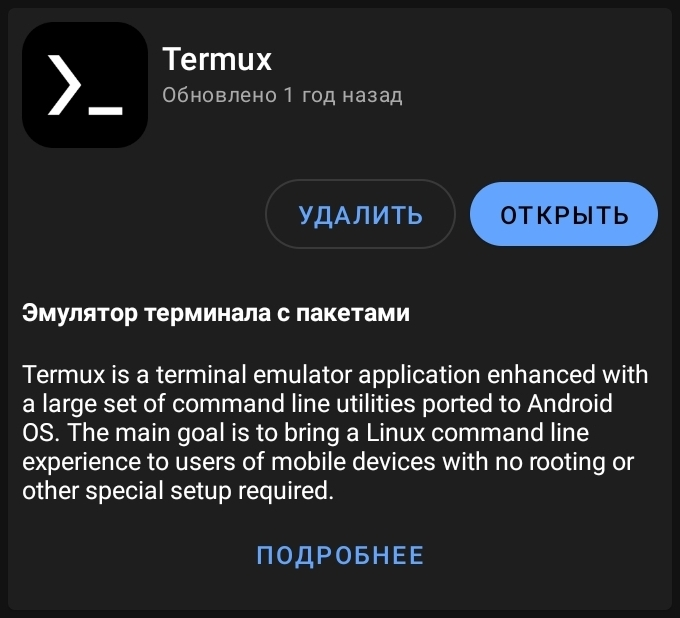

# WebTermux
В этом руководсте описан процесс установки web сервера на телефон под управлением Android с помощью приложения Termux. В итоге мы получим локальный сервер, работающий с php, html, css, js и сервером базы данных sql (mariadb). 

Руководство может быть полезно для людей, изучающих основы php и web программирования, но нацелено на людей, желающих иметь свой домашний локальный web сервер и не желающих покупать для этого дела raspberry pi.

# Требования
~1.48 Гб свободного места. Чем более актуальная версия Android, тем лучше, я работал с Samsung A20, Android 11.

# Подготовка
Видео версия руководства доступна [тут]().

Для доступа к терминалу нашего телефона нам необходимо приложение Termux. Раньше оно было доступно прямиком из Play Market, но потом его перенесли на F-Droid. Так что начнём мы с того, что скачаем с официального [cайта](https://f-droid.org/ru/) приложение F-Droid и установим его на телефон. F-droid является каталогом приложений с открытым кодом. (Помимо самомго Termux там много полезных штук есть)

При первом запуске F-Droid немного повисит на обновлении репозиториев, после чего можно будет нормально его использовать. В поиске F-droid введите Termux, скачайте и установите это приложение.



Теперь у нас есть F-droid, который нам больше не понадобится и Termux. Дальнейшие действия мы будем проводить в последнем.

# Обновление Termux
На этом этапе мы установим необходимые пакеты в Termux, для начала желательно обновить все уже установленные пакеты:

```bash
pkg update -y
pkg upgrade -y
```


Во время процесса установки у вас могут несколько раз спросить разрешение конфликта версий. В принципе любой ваш ввод ничего не изменит, так что мы на все подобные вопросы будем отвечать пустым вводом `enter`, оставляя текущие версии файлов.

# SSH
Этот этап является опциональным.

Поскольку дальше надо будет провернуть множество действий, редактируя конфиг файлы, я предлагаю сначала установить ssh на наш телефон. С его помощью мы сможем подключиться к телефону через компьютер и вводить команды уже с него. Так будет быстрее и удобнее, тем более что установка ssh много времени не занимает

После обновления пакетов давайте установим пароль для нашего пользователя. Для этого сначала установим утилиту `passwd` и потом воспользуемся ей.

```bash
pkg install termux-auth
passwd
```

`passwd` попросит нас ввести новый пароль и потом подтвердить его. Желательно, конечно, запомнить введённый вами пароль, он нам ещё пригодится.

Теперь установим `openssh` и откроем порт 9000 для удалённого подключения

```bash
pkg install openssh -y
sshd -p 9000
```

Последнюю команду нужно будет вводить каждый раз при запуске Termux, чтобы к телефону можно было подключиться удалённо.

Хорошо, ssh установлен, теперь мы можем попробовать подключиться к нашему телефону через компьютер. Только у нас пока что нет имени пользователя и ip адреса телефона, поэтому для получения этих данных используем `whoami` и `ifconfig`

```bash
whoami
ifconfig
```


`whoami` даст нам имя пользователя, а в ifconfig чуть ниже поля `wlan0` мы сможем найти наш локальный ip адрес

Теперь с компьютера под Linux или MacOS мы подключаемся к нашему пользователю по его адресу:

```bash
ssh u0_a251@192.168.1.39 -p 9000
```

Если же вы используете Windows, то для подключения можете использовать программу [PuTTY](https://www.putty.org). Просто в полях для адреса и порта пропишите соответствующие значения.


В обоих случаях вас попросят сначала внести новый адрес в список знакомых хостов, вводим yes или нажимаем agree, после чего нас попросят ввести пароль пользоватяля. Вводим тот пароль, который мы устанавливали через `passwd`.

Если всё было введно верно, то теперь вы увидите знакомый терминал нашего Termux'а. 

# Конфиг файлы
Вернёмся к основному маршруту. На этом этапе мы установим пакеты, необходимые для Web разработки, а также текстоывй редактор vim, настроим с его помощью конфигурационные файлы Web сервера.

```bash
pkg install apache2 php-apache phpmyadmin mariadb vim -y
```

После установки пакетов давайте создадим папку нашего сайта. Эта папка будет является корневой. При желании вы можете расположить эту папку в любом угодном вам месте, я же оставлю её в корневой папке Termux'а:

```bash
mkdir Web
```

#
Далее нам надо будет отредактировать три конфигурационных файла. Вы можете пойти двумя путями. Либо просто взять и через vim полностью их перезаписать, либо отредактировать все элементы каждого конфиг файла вручную, чтобы понимать, что вы меняете, как и на что это влияет. Если вы выбираете быстрый и лёгкий путь, то просто замените содержимое файлов по их адресам на те файлы, которые оставлены в этом гайде под тем же именем.

Для полной перезаписи файла сначала скопируйте нужное содержимое, потом откройте каждый файл по очереди в vim и выполните следующие сочетания клавишь: `V`, `G`, `d`, `i`, вставьте нужный текст, затем `esc`, `:wq`. Вся эта последовательность должна будет выделить (V) первую строчку, потом весь текст (G), удалить его (d), после чего в режиме ввода (i) вы вставите новый текст, затем выйдите из режима ввода (esc), сохраните (w) и закроете (q) файл. Так для каждого из следующих файлов:

```
vim ~/../usr/etc/apache2/httpd.conf
vim ~/../usr/etc/apache2/extra/httpd-vhosts.conf
vim ~/../usr/share/phpmyadmin/config.inc.php
```

После этого переходите к следующему этапу.

Если же вы выбираете долгий путь, то он перед вами. 

Перейдём к настройке конфиг файлов. Начнём с файла `httpd.conf`, я буду редактировать чего через vim:

```bash
vim ~/../usr/etc/apache2/httpd.conf
```

Теперь в поиске vim найдём 8080: введите `/8080`, потом `enter`. Мы должны были найти строку с надписью:

```
Listen 8080
```

Нам надо дописать ниже этой строчки ещё 3360 порт для прослушки, его мы будем испльзовать для PhpMyAdmin. Для редактирования файла введите `i` (от сокращения insert) чтобы перейти в режим ввода, и допишите недостающую строчку:

```bash
Listen 8080
Listen 3360
```

После этого нажмите `esc` чтобы выйти из режима ввода. Теперь мы можем продолжить искать следующий фрагмент для изменения, также используя `/` для поиска, `i` для редактирования текста и `esc` для выхода из него.

Ищем `mpm` в поиске vim, после чего редактируем следующие строчки:

```bash
#LoadModule mpm_prefork_module libexec/apache2/mod_mpm_prefork.so
LoadModule mpm_worker_module libexec/apache2/mod_mpm_worker.so
```

Верхний модуль мы включаем, нижний выключаем. После чего выше этих двух модулей дописываем ещё один. Итоговый фрагмент будет следующим:

```bash
LoadModule php_module libexec/apache2/libphp.so
LoadModule mpm_prefork_module libexec/apache2/mod_mpm_prefork.so
#LoadModule mpm_worker_module libexec/apache2/mod_mpm_worker.so
```

#
Движем дальше, в поиске vim теперь вводим `www`, нам нужна эта строчка:

```bash
#ServerName www.example.com:8080
```

Включаем эту строку, убирая знак `#`.

```bash
ServerName www.example.com:8080
```

#
Теперь ищем `rride`, редактируем следующий блок:
```bash
<Directory />
    AllowOverride none
    Require all denied
</Directory>
```

`denied` меняем на `granted`:

```bash
<Directory />
    AllowOverride none
    Require all granted
</Directory>
```

#
Теперь найдём `htdoc`, меняем следующий кусочек:
```bash
DocumentRoot "/data/data/com.termux/files/usr/share/apache2/default-site/htdocs"
<Directory "/data/data/com.termux/files/usr/share/apache2/default-site/htdocs">
```

Устанавливаем адрес папки, которую мы недавно создавали. (Если вы создавали папку в другом месте и не знаете её адрес, то находясь в этой папке вы можете узнать его с помощью команды `pwd`)

```bash
DocumentRoot "/data/data/com.termux/files/home/Web"
<Directory "/data/data/com.termux/files/home/Web">
```

#
Переходим к следующему кусочку, ищем `dir_mo` и редактируем кусочек:
```bash
<IfModule dir_module>
    DirectoryIndex index.html
</IfModule>
```

Перед `index.html` дописываем `index.php`:

```bash
<IfModule dir_module>
    DirectoryIndex index.php index.html
</IfModule>
```

#
Затем ищем `hosts` и редактируем другой кусочек:

```bash
# Virtual hosts
#Include etc/apache2/extra/httpd-vhosts.conf
```

Открываем файл vhosts, убирая знак `#`:

```bash
# Virtual hosts
Include etc/apache2/extra/httpd-vhosts.conf
```

Теперь мы переходим в самый низ файла. для этого вместо `/` для поиска vim вы можете ввести просто заглавную `G` чтобы оказаться внизу файла. Теперь перед большим комментарием нам надо добавить три строчки:

```bash
<IfModule ssl_module>
SSLRandomSeed startup builtin
SSLRandomSeed connect builtin
</IfModule>

#
#  Load config files from the config directory 'conf.d'.
#
Include etc/apache2/conf.d/*.conf
```

До комментария добавляем FilesMatch:

```bash
<IfModule ssl_module>
SSLRandomSeed startup builtin
SSLRandomSeed connect builtin
</IfModule>

<FilesMatch \.php$> 
SetHandler application/x-httpd-php
</FilesMatch>

#
#  Load config files from the config directory 'conf.d'.
#
Include etc/apache2/conf.d/*.conf
```

Отлично, с этим файлом мы покончили, осталось только сохранить все изменённые поля. Для этого `esc`, потом `:wq` чтобы сохранить (w) файл и закрыть его (q).

Теперь мы вышли из vim обратно в shell. Но это не на долго

#
Переходим к следующему файлу, это будет недавно открытый нами vhosts. Откроем его через vim:

```
vim ~/../usr/etc/apache2/extra/httpd-vhosts.conf
```

Файл небольшой, так что вы можете либо либо прокрутить его вниз, либо быстро ввести заглавную `G`. Теперь нам надо будет настроить следующий фрагмент:

```bash
<VirtualHost *:8080>
    ServerAdmin webmaster@dummy-host.example.com
    DocumentRoot "/data/data/com.termux/files/usr/docs/dummy-host.example.com"
    ServerName dummy-host.example.com
    ServerAlias www.dummy-host.example.com
    ErrorLog "var/log/apache2/dummy-host.example.com-error_log"
    CustomLog "var/log/apache2/dummy-host.example.com-access_log" common
</VirtualHost>

<VirtualHost *:8080>
    ServerAdmin webmaster@dummy-host2.example.com
    DocumentRoot "/data/data/com.termux/files/usr/docs/dummy-host2.example.com"
    ServerName dummy-host2.example.com
    ErrorLog "var/log/apache2/dummy-host2.example.com-error_log"
    CustomLog "var/log/apache2/dummy-host2.example.com-access_log" common
</VirtualHost>
```

Тут будет много изменений, смотрите внимательно. Начнём с верхнего vhost'а. Нам надо снова изменить корневую папку `DocumentRoot` нашего сайта, указав нужный адрес. Вместе с этим мы меняем поле `ServerName` указывая там `localhost`.
 
Перейдём к нижнему vhost'у. Это будет наш отдельный хост для подключения к PhpMyAdmin. У него мы меняем сам порт прослушки с `8080` на `3360`. Теперь поле `DocumentRoot` заменяем на адрес phpmyadmin: `/data/data/com.termux/files/usr/share/phpmyadmin` и также меняем `ServerName` на `localhost`. 

Вот что вышло в итоге:

```bash
<VirtualHost *:8080> 
    ServerAdmin webmaster@dummy-host.example.com 
    DocumentRoot "/data/data/com.termux/files/home/Web" 
    ServerName localhost 
    ServerAlias www.dummy-host.example.com 
    ErrorLog "var/log/apache2/dummy-host.example.com-error_log" 
    CustomLog "var/log/apache2/dummy-host.example.com-access_log" common 
</VirtualHost> 

<VirtualHost *:3360> 
    ServerAdmin webmaster@dummy-host2.example.com 
    DocumentRoot "/data/data/com.termux/files/usr/share/phpmyadmin" 
    ServerName localhost
    ErrorLog "var/log/apache2/dummy-host2.example.com-error_log" 
    CustomLog "var/log/apache2/dummy-host2.example.com-access_log" common
</VirtualHost>
```

Теперь при заходе на адрес нашего телефона через порт 8080 мы будем попадать в папку сайта `Web`. А если укажем порт 3360, то попадём в PhpMyAdmin. Этим мы займёмся совсем скоро.

С файлом vhost'ов мы закончили, теперь выйдем в режим команд через `esc`, затем сохраним файл и выйдем из vim: `:wq`.

#
Остался последний для редактирования файл - это конфиг php. Откроем его через vim:

```bash
vim ~/../usr/share/phpmyadmin/config.inc.php
```

Теперь найдём в поиске vim `localhost` и заменим его на `127.0.0.1`. 
Было так:

```bash
$cfg['Servers'][$i]['host'] = 'localhost';
```

Стало так:
```bash
$cfg['Servers'][$i]['host'] = '127.0.0.1';
```

Отлично, теперь мы настроили всё необходимое. Закроем конфиг php через старые `esc` и `:wq`.

# Тестирование Apache и Mariadb
Мы настроили php, база данных в настройке не нуждается, теперь давайте протестируем, всё ли правильно работает. Запустим сначала apache, а потом sql сервер:

```
apachectl
mysqld_safe --skip-grant-tables --general-log & 
```

Если всё сделано правильно, то `apachectl` ничего вам не скажет, а `mysqld` оповестит о запуске демона. Нажимаем `enter`, чтобы вернуть себе shell. 

Теперь мы можем посмотреть наш живой сервер. Для этого перейдём в браузере на адрес нашего телефона по порту 8080. (Для получения ip вашего телефона можете использовать всё тот же `ifconfig`, ip вы найдёте рядом с надписью `wlan0`). Я же перехожу по своему адресу 192.168.1.39:8080 и вижу следующую картину:


Всё правильно работает. Поскольку никакого содержания внутри сайта у нас нет, apache показывает содержание пустой папки. Если же мы что-то добавим в папку `Web`, то оно появится в списке.

Теперь давайте обратимся к PhpMyAdmin, зайдя на по тому же ip на порт 3360:


Нас встречает работающая консоль разработчика. Логином от неё будет служить имя нашего пользователя, которое можно узнать через `whoami`, а паролем будет стандартный `root`.

Хорошо, наш сервер работает, база данных тоже дышит, теперь давайте определим пару команд, чтобы наоборот закрыть наш сверер и без ошибок выключить сервер sql:

```bash
pkill mariadb
apachectl -k stop
```

Первая команда выключит сервер базы данных, вторая команда отключит apache. 

#
Поскольку каждый раз прописывать команды для запуска и выключения базы данных - дело не благородное, создадим два скрипта, которые будут это всё делать за нас. Для этого в домашней папке Termux давайте создадим два файла:

```bash
cd 
vim run.sh
```

Это будет скрипт для запуска сервера, запишем в него пару команд:

```bash
apachectl
mariadbd-safe --skip-grant-tables --general-log & 
```

Сохраним и закроем файл, после чего создадим скрипт `end.sh`, который будет закрывать наш сервер:

```bash
vim end.sh
```

В него запишем ещё две команды:

```bash
pkill mariadb
apachectl -k stop
```

Опять сохраним и закороем файл.

Осталось только выдать нашим скриптам права на исполнение, для этого выполним ещё одну команду:

```bash
chmod +x run.sh end.sh
```

Теперь при запуске Termux мы можем использовать `./run.sh` и `./end.sh` для запуска и закрытия сервера.

# На всякий случай
У mariadb есть одна очень неприятная проблема - если ваш телефон с работающим сервером внезапно выключится, безапосно не закрыв демон сервера sql, то база данных будет повреждена. Если же это внезапно случилось, то повреждённую базу данных вы сможете найти в следующей папке:

```
cd /data/data/com.termux/files/usr/var/lib/mysql
```

Для того, чтобы вернуть всё обратно в рабочее состояние придётся удалить папку со сломанной базой данных и создать её заново.

Так что обязательно перезагружайте или выключайте телефон только после того, как будет безопасно закрыт sql сервер через 

```bash
pkill mariadb
```

Ну и не забывайте делать бэкапы на всякий случай.
